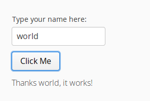

# Getting started: Vaadin 8

To start, just add the following lines into your Gradle `build.gradle` file:

```groovy
repositories {
    maven { url "https://dl.bintray.com/mvysny/github" }
}
dependencies {
    testCompile "com.github.vok.karibudsl:karibu-testing-v8:0.3.3"
}
```

You will also need to add Kotlin support to your project, even if it will compile the testing classes only: [Using Gradle](https://kotlinlang.org/docs/reference/using-gradle.html).

## Writing your first test

Let's start by testing a custom component. Say that we have a `GreetingLabel` which greets the user nicely:
```kotlin
class GreetingLabel : Label() {
    fun greet(name: String) {
        value = "Hello, $name"
    }
}
```

We want to test that calling `greet("world")` will properly set the label's value:
```kotlin
class MyUITest : DynaTest({
    test("proper greeting") {
        val label = GreetingLabel()
        label.greet("world")
        expect("Hello, world") { label.value }
    }
})
```

Nothing special here - we have just instantiated the label as any other object, and then asserted that the value is updated properly.

With this approach you can test even larger components; since views are components as well you can test individual views with this approach as well.
However, soon you will hit the limit:

* Your components will probably start to fail because `UI.getCurrent()` or `VaadinSession.getCurrent()`
returns `null`;
* Your views can't navigate because the Navigator has not been configured, etc.

We need to mock the Vaadin environment properly.

## Testing an actual application

This is where the `karibu-testing` library comes handy - it provides you with means of mocking the Vaadin environment.

Let's look at the [Karibu-DSL Helloworld Application](https://github.com/mvysny/karibu-helloworld-application) - a very sample application
consisting of just the UI - no views. Because of its simplicity it is an excellent testing grounds for your experiments -
just clone the app and start experimenting.

The UI class is simple:

```kotlin
class MyUI : UI() {

    @Override
    override fun init(vaadinRequest: VaadinRequest?) {
        lateinit var layout: VerticalLayout
        layout = verticalLayout {
            val name = textField {
                caption = "Type your name here:"
            }
            button("Click Me", {
                println("Thanks ${name.value}, it works!")
                layout.label("Thanks ${name.value}, it works!")
            })
        }
    }
}
```

It will produce the following app:



In order to test this app, we need to initialize `MyUI`. But it's not THAT simple: in order to properly initialize the `UI` class, a proper Vaadin
environment needs to be prepared:

* We need to prepare the `VaadinSession` in a way that `VaadinSession.getCurrent()` returns a proper session
* We need to run the testing code with Vaadin lock obtained (since we're going to invoke Vaadin components and that can only be done on the UI thread)
* We need to create the UI instance and initialize it properly - besides other things we need to call the `UI.init()` method.

Luckily, this is exactly what the `MockVaadin.setup()` function does. It will prepare everything for us and even initialize the `UI`; we just need
to provide the `UI` instance to the function:

```kotlin
class MyUITest : DynaTest({
    beforeEach { MockVaadin.setup({ MyUI() }) }
})
```

> We're using the [DynaTest](https://github.com/mvysny/dynatest) testing framework which runs on top of JUnit5. You can of course use whatever
testing library you wish.

We can verify that everything is prepared, simply by obtaining the current UI contents and asserting that it is a `VerticalLayout` (since our
simple testing app uses `VerticalLayout` as the root component):

```kotlin
class MyUITest : DynaTest({
    beforeEach { MockVaadin.setup({ MyUI() }) }
    test("simple UI test") {
        val layout = UI.getCurrent().content as VerticalLayout
    }
})
``` 

todo more

## Example project

The [Karibu-DSL Helloworld Application](https://github.com/mvysny/karibu-helloworld-application) is a very simple project consisting of just
one view and a single test for that view.
